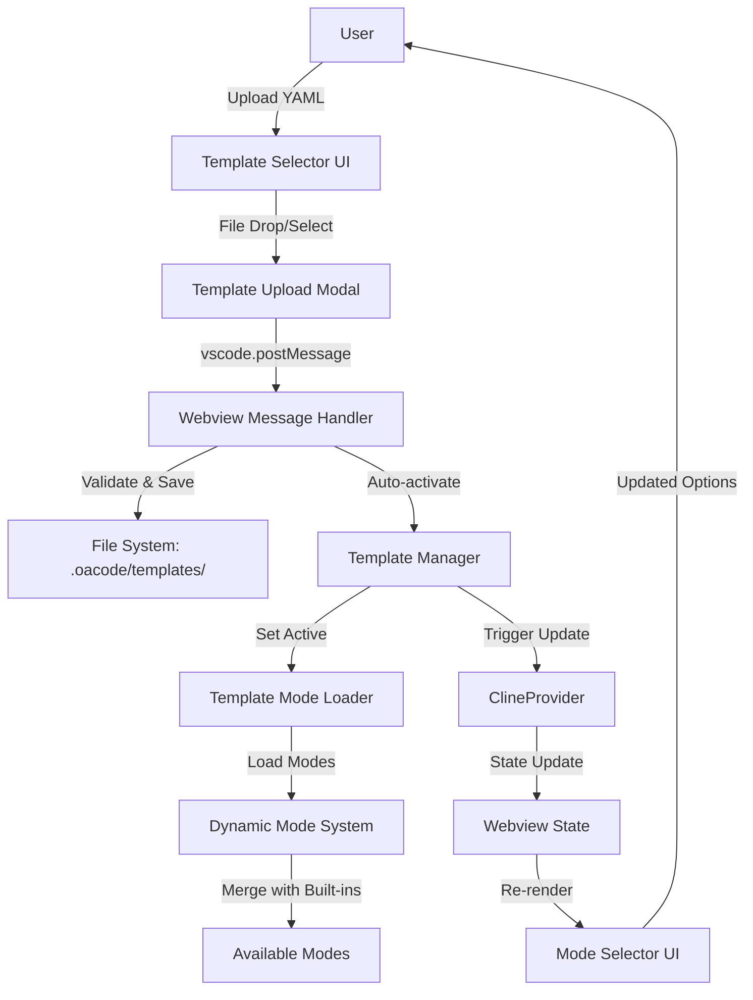
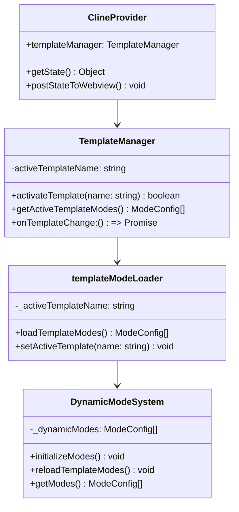
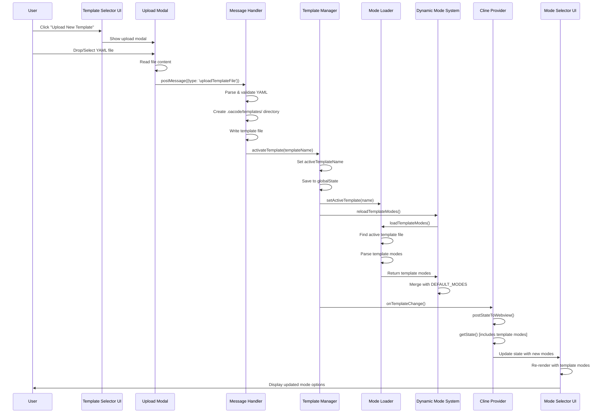
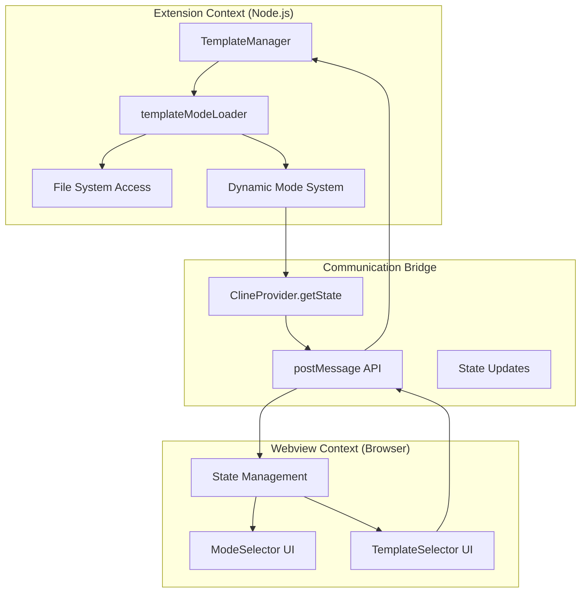

# Template System Architecture Documentation

## Table of Contents
1. [System Overview](#system-overview)
2. [Architecture Components](#architecture-components)
3. [Complete Data Flow](#complete-data-flow)
4. [Detailed Code Analysis](#detailed-code-analysis)
5. [Technical Implementation](#technical-implementation)
6. [Usage Examples](#usage-examples)

## System Overview

The template system allows users to dynamically extend the application's mode system by uploading YAML templates that define custom modes. These templates are processed, validated, and integrated into the existing mode infrastructure in real-time.



### Key Features
- **Dynamic Mode Loading**: Templates are loaded at runtime without restart
- **Auto-activation**: Uploaded templates are automatically activated
- **State Persistence**: Active template survives VS Code restarts
- **Conflict Resolution**: Template modes don't override built-in modes
- **Real-time UI Updates**: Mode selector updates immediately after upload

## Architecture Components

### 1. File System Structure
```
workspace/
├── .oacode/
│   └── templates/
│       ├── simple-test-template.yaml
│       ├── data-modes-template.yaml
│       └── custom-template.yaml
```

### 2. Core Classes Hierarchy


## Complete Data Flow



## Detailed Code Analysis

### 1. Template Upload Handler (`webviewMessageHandler.ts`)

```typescript
case "uploadTemplateFile": {
    if (message.filename && message.content) {
        try {
            // Step 1: Parse and validate the YAML content
            // This ensures the file is valid YAML before proceeding
            let parsedContent: any
            try {
                parsedContent = yaml.parse(message.content)
            } catch (yamlError: any) {
                vscode.window.showErrorMessage(`Invalid YAML format: ${yamlError.message}`)
                return
            }

            // Step 2: Validate against the customModes schema
            // This ensures the template has the correct structure and required fields
            const validationResult = customModesSettingsSchema.safeParse(parsedContent)
            if (!validationResult.success) {
                const issues = validationResult.error.issues
                    .map((issue: any) => `• ${issue.path.join(".")}: ${issue.message}`)
                    .join("\n")
                vscode.window.showErrorMessage(`Template validation failed:\n${issues}`)
                return
            }

            // Step 3: Ensure the file has the correct extension
            // Only .yaml and .yml files are supported
            if (!message.filename.endsWith('.yaml') && !message.filename.endsWith('.yml')) {
                vscode.window.showErrorMessage(`Template files must have .yaml or .yml extension`)
                return
            }

            // Step 4: Get workspace path and create templates directory
            // Templates are stored in workspace/.oacode/templates/
            const workspacePath = getWorkspacePath()
            if (!workspacePath) {
                vscode.window.showErrorMessage(`No workspace found. Please open a workspace to upload templates.`)
                return
            }

            const templatesDir = path.join(workspacePath, ".oacode/templates")
            await fs.mkdir(templatesDir, { recursive: true })

            // Step 5: Write the template file to disk
            const filePath = path.join(templatesDir, message.filename)
            await fs.writeFile(filePath, message.content, "utf-8")

            // Step 6: Extract template metadata for success message
            const modeCount = validationResult.data.customModes?.length || 0
            const modeNames = validationResult.data.customModes?.map((m: any) => m.name || m.slug).join(", ") || ""

            // Step 7: CRITICAL - Automatically activate the uploaded template
            // This is what makes the template modes immediately available
            const templateName = path.basename(message.filename, path.extname(message.filename))
            await provider.templateManager.activateTemplate(templateName)

            // Step 8: Show success notification to user
            vscode.window.showInformationMessage(
                `Template "${message.filename}" uploaded and activated successfully! Contains ${modeCount} mode(s): ${modeNames}`
            )

            // Step 9: Update the webview with latest template list
            // This refreshes the template selector dropdown
            const templates = await provider.templateManager.getAvailableTemplates()
            const activeTemplate = provider.templateManager.getActiveTemplateName()
            
            await provider.postMessageToWebview({
                type: "templateList",
                payload: {
                    templates,
                    activeTemplate
                }
            })

        } catch (error) {
            console.error(`Error uploading template:`, error)
            vscode.window.showErrorMessage(`Failed to upload template: ${error instanceof Error ? error.message : String(error)}`)
        }
    }
    break
}
```

**Explanation**: This handler processes template uploads from the webview. It performs comprehensive validation, saves the file to the correct location, and crucially auto-activates the template to provide immediate functionality. The error handling ensures users get clear feedback about any issues.

### 2. Template Manager (`TemplateManager.ts`)

```typescript
export class TemplateManager {
    // Stores the currently active template name
    // null means no template is active (using only built-in modes)
    private activeTemplateName: string | null = null
    
    // VS Code disposables for cleanup (file watchers, etc.)
    private disposables: vscode.Disposable[] = []

    constructor(
        private readonly context: vscode.ExtensionContext,
        // Callback function called when template changes occur
        // This triggers webview updates and mode reloading
        private readonly onTemplateChange: () => Promise<void>,
    ) {
        this.loadActiveTemplate()       // Restore persisted active template
        this.watchTemplateDirectory()   // Set up file system watchers
    }

    /**
     * Activate a template by name - Core functionality
     * This is called when templates are uploaded or manually activated
     */
    public async activateTemplate(templateName: string): Promise<boolean> {
        // Step 1: Verify the template exists
        const templates = await this.getAvailableTemplates()
        const template = templates.find(t => t.name === templateName)
        
        if (!template) {
            throw new Error(`Template "${templateName}" not found`)
        }

        // Step 2: Set as active template in memory
        this.activeTemplateName = templateName
        
        // Step 3: Persist the active template to VS Code's global state
        // This ensures the template remains active after VS Code restarts
        await this.saveActiveTemplate()

        // Step 4: CRITICAL - Reload the dynamic mode system
        // This triggers the loading of modes from the newly active template
        await reloadTemplateModes()
        
        // Step 5: CRITICAL - Trigger webview update
        // This ensures the UI reflects the new template modes immediately
        await this.onTemplateChange()

        return true
    }

    /**
     * Get modes from the currently active template
     * Returns empty array if no template is active
     */
    public async getActiveTemplateModes(): Promise<ModeConfig[]> {
        // No active template = no template modes
        if (!this.activeTemplateName) {
            return []
        }

        const templatesDir = this.getTemplatesDirectory()
        if (!templatesDir) {
            return []
        }

        // Find the template file for the active template
        const templates = await this.getAvailableTemplates()
        const template = templates.find(t => t.name === this.activeTemplateName)
        
        if (!template) {
            console.warn(`Active template "${this.activeTemplateName}" not found`)
            // Clean up invalid active template reference
            this.activeTemplateName = null
            await this.saveActiveTemplate()
            return []
        }

        try {
            // Load and parse the template file
            const filePath = path.join(templatesDir, template.filename)
            const content = await fs.readFile(filePath, 'utf-8')
            const data = this.parseYamlSafely(content, filePath)

            // Validate and extract modes
            const validationResult = customModesSettingsSchema.safeParse(data)
            if (validationResult.success) {
                return validationResult.data.customModes
            }
        } catch (error) {
            console.error(`Failed to load active template modes:`, error)
        }

        return []
    }

    /**
     * Watch template directory for file system changes
     * Automatically reloads modes when template files are modified
     */
    private async watchTemplateDirectory(): Promise<void> {
        if (process.env.NODE_ENV === "test") {
            return  // Skip in test environment
        }

        const templatesDir = this.getTemplatesDirectory()
        if (!templatesDir) {
            return
        }

        // Create directory if it doesn't exist
        try {
            await fs.mkdir(templatesDir, { recursive: true })
        } catch (error) {
            console.warn('[TemplateManager] Failed to create templates directory:', error)
            return
        }

        // Set up file system watcher for YAML files
        const pattern = path.join(templatesDir, "**/*.{yaml,yml}")
        const watcher = vscode.workspace.createFileSystemWatcher(pattern)

        // Handler for any template file changes
        const handleChange = async () => {
            try {
                // Reload modes from templates
                await reloadTemplateModes()
                // Update webview with new modes
                await this.onTemplateChange()
            } catch (error) {
                console.error('[TemplateManager] Error handling template change:', error)
            }
        }

        // Register handlers for all file system events
        this.disposables.push(watcher.onDidChange(handleChange))  // File modified
        this.disposables.push(watcher.onDidCreate(handleChange))  // New file created
        this.disposables.push(watcher.onDidDelete(handleChange))  // File deleted
        this.disposables.push(watcher)  // The watcher itself
    }

    /**
     * Load active template from VS Code's persistent storage
     * Called during initialization to restore previous state
     */
    private async loadActiveTemplate(): Promise<void> {
        // Retrieve from globalState (persists across VS Code sessions)
        this.activeTemplateName = await this.context.globalState.get<string | null>('activeTemplate', null)
        
        // Sync with the template loader module
        setActiveTemplate(this.activeTemplateName)
    }

    /**
     * Save active template to persistent storage
     * Ensures template remains active after VS Code restart
     */
    private async saveActiveTemplate(): Promise<void> {
        // Save to VS Code's globalState
        await this.context.globalState.update('activeTemplate', this.activeTemplateName)
        
        // Sync with the template loader module
        setActiveTemplate(this.activeTemplateName)
    }
}
```

**Explanation**: TemplateManager is the central orchestrator for template lifecycle. It handles activation, persistence, file watching, and mode loading coordination. The key insight is that it serves as the bridge between file system operations and the dynamic mode system, ensuring state consistency across all components.

### 3. Template Mode Loader (`templateModeLoader.ts`)

```typescript
// Global state tracking the currently active template
// This is shared between the TemplateManager and the loading functions
let _activeTemplateName: string | null = null

/**
 * Set the active template name - called by TemplateManager
 * This keeps the loader in sync with the manager's state
 */
export function setActiveTemplate(templateName: string | null): void {
    _activeTemplateName = templateName
}

/**
 * Load modes from the currently active template only
 * This is the core function that the dynamic mode system calls
 * to get template modes for merging with built-in modes
 */
export async function loadTemplateModes(): Promise<ModeConfig[]> {
    // Early exit if no template is active
    // This is the most common case - no template loaded
    if (!_activeTemplateName) {
        return []
    }

    // Get the templates directory path
    const templatesDir = await getTemplatesDirectory()
    if (!templatesDir) {
        return []  // No workspace or templates directory
    }

    try {
        // Step 1: Scan the templates directory for YAML files
        const entries = await fs.readdir(templatesDir, { withFileTypes: true })
        const yamlFiles = entries
            .filter((entry) => entry.isFile() && (entry.name.endsWith('.yaml') || entry.name.endsWith('.yml')))

        // Step 2: Find the specific file that matches the active template name
        // Template name is the filename without extension
        let activeTemplateFile: string | null = null
        for (const file of yamlFiles) {
            const baseName = path.basename(file.name, path.extname(file.name))
            if (baseName === _activeTemplateName) {
                activeTemplateFile = path.join(templatesDir, file.name)
                break
            }
        }

        // Step 3: Handle case where active template file is not found
        if (!activeTemplateFile) {
            console.warn(`[TemplateModeLoader] Active template "${_activeTemplateName}" file not found`)
            return []
        }

        // Step 4: Load and parse the template file
        const modes = await loadModesFromTemplateFile(activeTemplateFile)
        console.log(`[TemplateModeLoader] Loaded ${modes.length} modes from active template "${_activeTemplateName}"`)
        return modes

    } catch (error) {
        console.error("[TemplateModeLoader] Failed to load template modes:", error)
        return []  // Graceful fallback - return empty array
    }
}

/**
 * Load modes from a single YAML template file
 * Handles parsing, validation, and error recovery
 */
async function loadModesFromTemplateFile(filePath: string): Promise<ModeConfig[]> {
    try {
        // Step 1: Read the file content
        const content = await fs.readFile(filePath, "utf-8")
        
        // Step 2: Parse YAML with character cleaning
        // This handles invisible characters that can break YAML parsing
        const data = parseYamlSafely(content, filePath)

        // Step 3: Validate structure - must have customModes array
        if (!data || typeof data !== "object" || !data.customModes) {
            return []
        }

        // Step 4: Validate against schema
        // This ensures all required fields are present and correctly typed
        const result = customModesSettingsSchema.safeParse(data)

        if (!result.success) {
            console.error(`[TemplateModeLoader] Schema validation failed for ${filePath}:`, result.error)
            return []
        }

        // Step 5: Return the validated modes
        // These will be merged with built-in modes by the dynamic mode system
        return result.data.customModes

    } catch (error) {
        console.error(`[TemplateModeLoader] Failed to load modes from template ${filePath}:`, error)
        return []  // Always return empty array on error to prevent crashes
    }
}

/**
 * Parse YAML content with enhanced error handling and character cleaning
 * This handles common issues with copy-pasted YAML content
 */
function parseYamlSafely(content: string, filePath: string): any {
    // Step 1: Remove BOM (Byte Order Mark) characters
    let cleanedContent = stripBom(content)
    
    // Step 2: Clean problematic invisible characters
    // These often come from copying from web pages or documents
    cleanedContent = cleanInvisibleCharacters(cleanedContent)

    try {
        // Step 3: Parse the cleaned YAML
        const parsed = yaml.parse(cleanedContent)
        return parsed ?? {}  // Return empty object if parsing results in null/undefined
    } catch (yamlError) {
        const errorMsg = yamlError instanceof Error ? yamlError.message : String(yamlError)
        console.error(`[TemplateModeLoader] Failed to parse YAML from ${filePath}:`, errorMsg)
        return {}  // Return empty object on parse failure
    }
}
```

**Explanation**: The template mode loader is responsible for the actual file I/O and parsing of template files. It maintains state synchronization with TemplateManager and provides robust error handling. The key design principle is to always return valid data (even if empty) to prevent downstream crashes.

### 4. Dynamic Mode System (`modes.ts`)

```typescript
// Dynamic array that holds the merged modes (built-in + template modes)
// This replaces the static DEFAULT_MODES export with a dynamic system
let _dynamicModes: ModeConfig[] = [...DEFAULT_MODES]

// Flag to prevent duplicate initialization
let _templateModesLoaded = false

// Conditional import of template loading functionality
// This only works in the Node.js extension environment, not in the webview
let loadTemplateModes: (() => Promise<import("@roo-code/types").ModeConfig[]>) | undefined
try {
    // Environment detection - only load in Node.js (extension) context
    if (typeof window === 'undefined' && typeof process !== 'undefined' && process.versions?.node) {
        loadTemplateModes = require("./templateModeLoader").loadTemplateModes
    }
} catch (error) {
    // Silently fail in webview environment - this is expected
    loadTemplateModes = undefined
}

/**
 * Initialize the dynamic mode system with template modes
 * This is called during extension startup and when templates change
 */
export async function initializeModes(): Promise<void> {
    // Prevent duplicate initialization
    if (_templateModesLoaded) {
        return
    }

    try {
        // Only load template modes in Node.js environment (extension)
        // The webview gets modes through state updates, not direct loading
        if (loadTemplateModes) {
            // Step 1: Load modes from the currently active template
            const templateModes = await loadTemplateModes()
            
            // Step 2: Create a set of built-in mode slugs for conflict detection
            const slugs = new Set(DEFAULT_MODES.map(mode => mode.slug))
            
            // Step 3: Filter out template modes that conflict with built-in modes
            // Built-in modes take precedence to maintain system stability
            const uniqueTemplateModes = templateModes.filter(mode => {
                if (slugs.has(mode.slug)) {
                    console.warn(`[Modes] Template mode "${mode.slug}" conflicts with built-in mode, skipping`)
                    return false
                }
                return true
            })

            // Step 4: CRITICAL - Merge built-in modes with template modes
            // This creates the unified mode system that the rest of the app uses
            _dynamicModes = [...DEFAULT_MODES, ...uniqueTemplateModes]
            _templateModesLoaded = true
            
            console.log(`[Modes] Initialized with ${DEFAULT_MODES.length} built-in modes and ${uniqueTemplateModes.length} template modes`)
        } else {
            // In webview environment, just use built-in modes
            // Template modes will be provided via state updates
            _dynamicModes = [...DEFAULT_MODES]
            _templateModesLoaded = true
            console.log(`[Modes] Initialized with ${DEFAULT_MODES.length} built-in modes (webview environment)`)
        }
    } catch (error) {
        console.error("[Modes] Failed to load template modes:", error)
        // Fallback to built-in modes only
        _dynamicModes = [...DEFAULT_MODES]
        _templateModesLoaded = true
    }
}

/**
 * Reload template modes - used for hot reloading when templates change
 * This is called by TemplateManager when templates are activated/deactivated
 */
export async function reloadTemplateModes(): Promise<void> {
    // Reset the loaded flag to force reinitialization
    _templateModesLoaded = false
    // Reinitialize with the current active template
    await initializeModes()
}

/**
 * Get the current dynamic modes array
 * This is the main interface used by the rest of the application
 */
export function getModes(): readonly ModeConfig[] {
    return _dynamicModes
}

/**
 * Get all available modes, with custom modes overriding built-in and template modes
 * This function handles the three-tier mode system:
 * 1. Built-in modes (lowest priority)
 * 2. Template modes (medium priority)  
 * 3. Custom modes (highest priority)
 */
export function getAllModes(customModes?: ModeConfig[]): ModeConfig[] {
    if (!customModes?.length) {
        // No custom modes - return built-in + template modes
        return [..._dynamicModes]
    }

    // Start with built-in and template modes
    const allModes = [..._dynamicModes]

    // Process custom modes - they can override anything
    customModes.forEach((customMode) => {
        const index = allModes.findIndex((mode) => mode.slug === customMode.slug)
        if (index !== -1) {
            // Override existing mode (built-in or template)
            allModes[index] = customMode
        } else {
            // Add new mode
            allModes.push(customMode)
        }
    })

    return allModes
}

/**
 * Get mode by slug from the dynamic mode system
 * Checks custom modes first, then built-in + template modes
 */
export function getModeBySlug(slug: string, customModes?: ModeConfig[]): ModeConfig | undefined {
    // Check custom modes first (highest priority)
    const customMode = customModes?.find((mode) => mode.slug === slug)
    if (customMode) {
        return customMode
    }
    
    // Then check built-in and template modes
    return _dynamicModes.find((mode) => mode.slug === slug)
}
```

**Explanation**: The dynamic mode system is the heart of the template integration. It manages the three-tier hierarchy (built-in → template → custom) and provides a unified interface for the rest of the application. The environment-aware loading ensures it works correctly in both extension and webview contexts.

### 5. State Management Integration (`ClineProvider.ts`)

```typescript
/**
 * Get current state including template modes for webview
 * This is the critical function that bridges the extension's template modes
 * with the webview's mode selector UI
 */
async getState() {
    const stateValues = this.contextProxy.getValues()
    
    // Start with regular custom modes from the custom modes manager
    let customModes = await this.customModesManager.getCustomModes()

    // CRITICAL INTEGRATION: Include template modes in customModes for webview
    // This is the key change that makes template modes visible in the UI
    try {
        // Step 1: Get modes from the currently active template
        const templateModes = await this.templateManager.getActiveTemplateModes()
        
        // Step 2: Merge template modes with custom modes, avoiding duplicates
        // Template modes are treated as "custom modes" from the webview's perspective
        const templateModesSlugs = templateModes.map(mode => mode.slug)
        const filteredCustomModes = customModes.filter(mode => !templateModesSlugs.includes(mode.slug))
        
        // Step 3: Combine arrays with template modes first
        // This gives template modes precedence over conflicting custom modes
        customModes = [...templateModes, ...filteredCustomModes]
        
    } catch (error) {
        console.warn('[ClineProvider] Failed to load template modes for state:', error)
        // Continue with just custom modes if template loading fails
    }

    // Build the complete state object
    return {
        // ... other state properties
        customModes,  // Now includes template modes seamlessly
        // ... more state properties
    }
}

/**
 * Post state updates to webview
 * This triggers UI updates when templates change
 */
async postStateToWebview() {
    // Get the complete state (including template modes)
    const state = await this.getStateToPostToWebview()
    
    // Send to webview - this will cause mode selector to re-render
    this.postMessageToWebview({ type: "state", state })
}
```

**Explanation**: The state management integration is the bridge that makes template modes visible to the webview. By including template modes in the `customModes` array, they become seamlessly integrated into the existing UI without requiring changes to the webview components.

### 6. UI Components

#### Template Selector (`TemplateSelector.tsx`)

```typescript
export const TemplateSelector = ({ disabled = false, className }: TemplateSelectorProps) => {
    // Component state for managing templates and UI
    const [templates, setTemplates] = useState<TemplateInfo[]>([])
    const [activeTemplate, setActiveTemplate] = useState<string | null>(null)
    const [showUploadModal, setShowUploadModal] = useState(false)
    const [dragActive, setDragActive] = useState(false)

    // Load template list on component mount
    useEffect(() => {
        // Request current template list from extension
        vscode.postMessage({ type: "getTemplateList" })
    }, [])

    // Listen for template list updates from extension
    useEffect(() => {
        const handler = (event: MessageEvent) => {
            const message = event.data
            if (message.type === "templateList") {
                const payload = message.payload as TemplateListPayload
                setTemplates(payload.templates)      // Available templates
                setActiveTemplate(payload.activeTemplate)  // Currently active template
                setIsLoading(false)
            }
        }

        window.addEventListener("message", handler)
        return () => window.removeEventListener("message", handler)
    }, [])

    // Handle template selection/activation
    const handleChange = React.useCallback((selectedValue: string) => {
        if (selectedValue === "none") {
            // Deactivate current template - use built-in modes only
            vscode.postMessage({ type: "deactivateTemplate" })
            setActiveTemplate(null)
        } else if (selectedValue !== activeTemplate) {
            // Activate selected template
            vscode.postMessage({ 
                type: "activateTemplate", 
                templateName: selectedValue 
            })
            setActiveTemplate(selectedValue)
        }
    }, [activeTemplate])

    // Handle template upload via action
    const handleAction = React.useCallback((actionValue: string) => {
        if (actionValue === "upload") {
            setShowUploadModal(true)
        }
    }, [])

    // Handle direct file drop on the selector
    const handleFileDrop = React.useCallback((files: FileList) => {
        const file = files[0]
        if (file && (file.name.endsWith('.yaml') || file.name.endsWith('.yml'))) {
            // Process dropped file directly
            file.text().then(content => {
                vscode.postMessage({
                    type: 'uploadTemplateFile',
                    filename: file.name,
                    content: content
                })
                // Auto-refresh after a short delay
                setTimeout(() => {
                    vscode.postMessage({ type: "getTemplateList" })
                }, 500)
            }).catch(error => {
                console.error('Failed to read dropped file:', error)
            })
        }
    }, [])

    // Build dropdown options
    const options = [
        {
            value: "none",
            label: "No Template",
            description: "Use built-in modes only",
        },
        // Map available templates to dropdown options
        ...templates.map(template => ({
            value: template.name,
            label: template.name,
            description: `${template.modeCount} mode(s): ${template.modes.map(m => m.name).join(", ")}`,
        })),
        {
            value: "upload",
            label: "📁 Upload New Template...",
            description: "Add a new YAML template file",
            type: DropdownOptionType.ACTION,  // Special action type
        },
    ]

    const currentValue = activeTemplate || "none"

    return (
        <div className={className}>
            {/* Enhanced dropdown with drag & drop support */}
            <SelectDropdown
                value={currentValue}
                title="Select Template"
                disabled={disabled}
                placeholder={templates.length === 0 ? "No templates available" : "Select template..."}
                options={options}
                onChange={handleChange}      // Handle template activation
                onAction={handleAction}      // Handle upload action
                onDrop={handleFileDrop}      // Handle direct file drop
                dragActive={dragActive}      // Visual feedback for drag state
            />
            
            {/* Upload modal for file selection */}
            <TemplateUploadModal
                isOpen={showUploadModal}
                onClose={() => setShowUploadModal(false)}
                onUploadSuccess={handleUploadSuccess}
            />
        </div>
    )
}
```

**Explanation**: The template selector provides a unified interface for template management. It combines template switching, upload functionality, and drag-and-drop in a single component, with real-time updates from the extension.

## Technical Implementation

### Environment Separation Strategy



**Key Points:**
- **Extension Context**: Has file system access, loads actual template files
- **Webview Context**: Gets template modes via state updates, no direct file access  
- **Communication**: Uses VS Code's postMessage API for bidirectional communication
- **State Sync**: Template modes are included in `customModes` array for seamless UI integration

### Error Handling Strategy

```typescript
// Multi-level error handling approach:

// 1. File Level - Graceful file operation failures
try {
    const content = await fs.readFile(filePath, 'utf-8')
    return parseTemplate(content)
} catch (error) {
    console.error(`Failed to read template: ${error}`)
    return []  // Return empty array, don't crash
}

// 2. Validation Level - Schema validation with user feedback
const result = customModesSettingsSchema.safeParse(data)
if (!result.success) {
    const issues = result.error.issues.map(issue => 
        `• ${issue.path.join(".")}: ${issue.message}`
    ).join("\n")
    vscode.window.showErrorMessage(`Template validation failed:\n${issues}`)
    return
}

// 3. System Level - Fallback to built-in modes
try {
    await reloadTemplateModes()
} catch (error) {
    console.error("Template reload failed:", error)
    // System continues with built-in modes only
}
```

### Performance Considerations

1. **Lazy Loading**: Templates are only parsed when activated
2. **Caching**: Template validation results are cached
3. **File Watching**: Efficient file system watchers for hot reloading  
4. **State Batching**: UI updates are batched to prevent excessive re-renders

### Security Validations

```typescript
// 1. File Extension Validation
if (!filename.endsWith('.yaml') && !filename.endsWith('.yml')) {
    throw new Error('Only YAML files are allowed')
}

// 2. Schema Validation
const validationResult = customModesSettingsSchema.safeParse(content)

// 3. Path Sanitization  
const safePath = path.join(templatesDir, path.basename(filename))

// 4. Content Sanitization
const cleanedContent = stripBom(content)
const sanitized = cleanInvisibleCharacters(cleanedContent)
```

## Usage Examples

### Example Template Structure

```yaml
# data-analyst-template.yaml
customModes:
  - slug: "data-analyst"
    name: "Data Analyst"
    iconName: "codicon-graph" 
    roleDefinition: "You are OpenAnalyst, an experienced data analyst..."
    whenToUse: "Use this mode when analyzing datasets and creating reports"
    description: "Analyze data and create business insights"
    groups: 
      - "read"
      - "edit"
      - "browser" 
      - "command"
    customInstructions: |
      Focus on:
      1. Data exploration and cleaning
      2. Statistical analysis  
      3. Visualization creation
      4. Business recommendations
```

### Template Upload Flow

```typescript
// 1. User drops file on template selector
handleFileDrop(files) → 

// 2. File content is read and sent to extension  
vscode.postMessage({
    type: 'uploadTemplateFile',
    filename: 'data-analyst.yaml', 
    content: yamlContent
}) →

// 3. Extension validates and saves file
webviewMessageHandler.uploadTemplateFile() →

// 4. Template is auto-activated
templateManager.activateTemplate('data-analyst') →

// 5. Modes are reloaded  
reloadTemplateModes() →

// 6. UI is updated with new modes
postStateToWebview() → modeSelector.render()
```

### Mode Usage After Template Activation

```typescript
// Template modes are now available everywhere built-in modes are used:

// 1. In mode selector dropdown
const allModes = getAllModes(customModes) // Includes template modes

// 2. In chat commands  
"/switch data-analyst" // Works with template modes

// 3. In system prompts
const modeConfig = getModeBySlug("data-analyst") // Finds template mode

// 4. In tool restrictions
isToolAllowedForMode("edit_file", "data-analyst", customModes) // Template mode rules apply
```

<function_calls>
<invoke name="TodoWrite">
<parameter name="todos">[{"content": "Create comprehensive template system documentation with code analysis", "status": "completed"}, {"content": "Add mermaid diagrams for system architecture", "status": "completed"}, {"content": "Document all code components with detailed comments", "status": "completed"}, {"content": "Create technical implementation guide", "status": "completed"}]